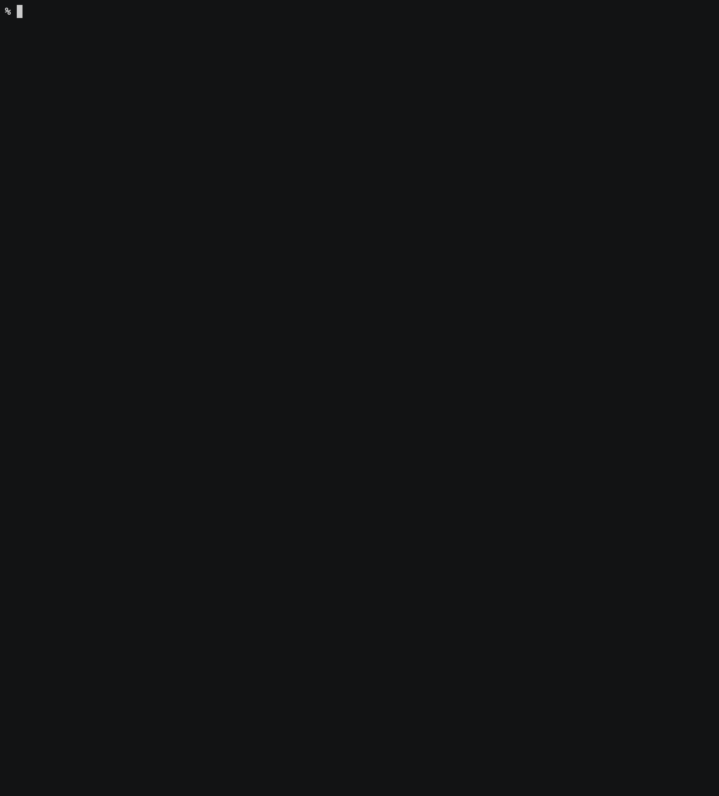
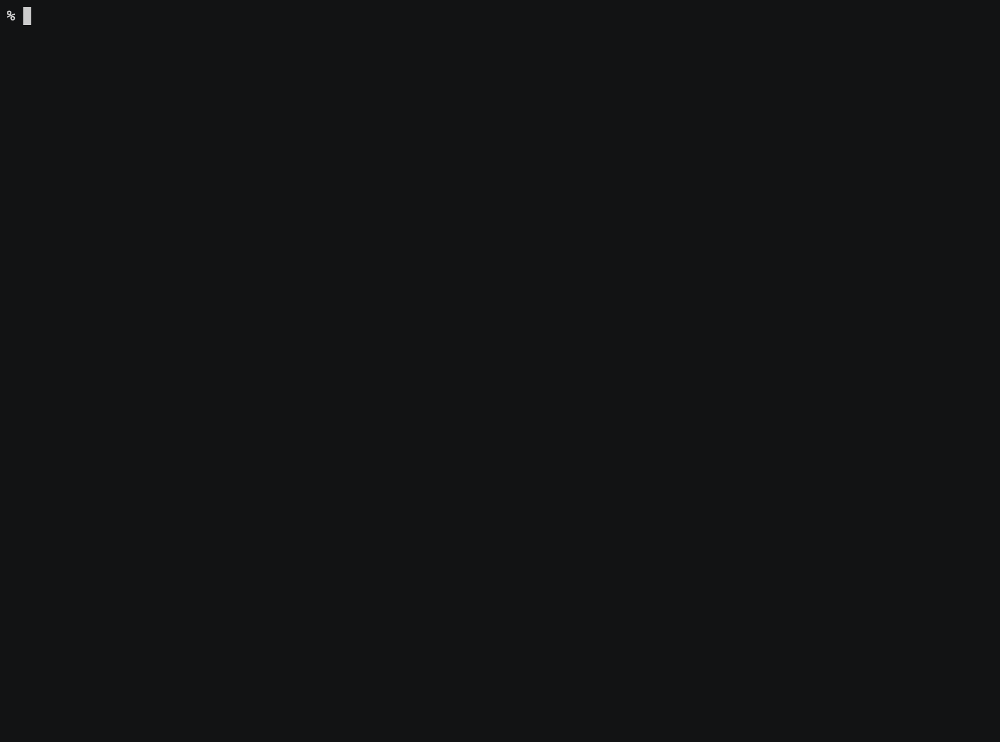

<!-- prettier-ignore-start -->
# CAP Multitenancy
{: .no_toc}
<!-- prettier-ignore-end -->

<!-- prettier-ignore -->
- TOC
{: toc}

## Summary

The CAP multitenancy commands offer convenience for interacting with CAP's multitenancy module (technical name
`@sap/cds-mtx`).

The registry is the second of three perspectives that MTX Tool offers on tenant information. This is the
middle layer, the higher layer is [Tenant Registry]({{ site.baseurl }}/tenant-registry/) and the lower layer is
[HANA Management]({{ site.baseurl }}/hana-management/). For an overview of the layers see
[Tenant Layers]({{ site.baseurl }}/tenant-registry/#summary).

For details and background information, please consult the official documentation:

- Capire [https://cap.cloud.sap](https://cap.cloud.sap)
- Subsection [Deployment/MTX APIs Reference](https://cap.cloud.sap/docs/guides/deployment/mtx-apis)
- Source Code [https://github.tools.sap/cap/cds-mtx](https://github.tools.sap/cap/cds-mtx)

Commands for this area are:

```
   === cap multitenancy (cds) ===
~  cdsl   --cds-list [TENANT]                        list all cds-mtx tenant names
~  cdsll  --cds-long-list [TENANT]                   long list all cds-mtx tenants
   cdsot  --cds-onboard-tenant TENANT_ID [METADATA]  onboard specific tenant
   cdsut  --cds-upgrade-tenant TENANT_ID             upgrade specific tenant
   cdsua  --cds-upgrade-all                          upgrade all tenants
*         --cds-offboard-tenant TENANT_ID            offboard specific tenant
*         --cds-offboard-all                         offboard all tenants
          ...    [METADATA]                          onboard subscription metadata
          ...    [TENANT]                            filter list for tenant id or subdomain
          ...    --json                              list in json
          ...    --time                              list includes timestamps
          ...    --auto-undeploy                     upgrade with auto undeploy
          ...    --first-instance                    upgrade only through first app instance

~  are read-only commands
*  are potentially _dangerous_ commands
```

## Environment

| environment variable  | effect                                                                              |
| :-------------------- | :---------------------------------------------------------------------------------- |
| `MTX_CDS_APP`         | override configured app for server (running `@sap/cds-mtxs`) accesses               |
| `MTX_CDS_CONCURRENCY` | change concurrency used for server calls (default is 10)                            |
| `MTX_CDS_FREQUENCY`   | change polling frequency milliseconds for server async job calls (default is 15000) |

## List and Long List

The list command `mtx cdsl` is the most common entry point and will show a table of all subscribed subacconts with
their most useful associated information.

If the provided information is insufficient or seems incomplete, then you can always fallback to the long list
`mtx cdsll`, which will show the endpoint's full unparsed response data.

If you already know which subaccount or tenant id you want the information for, then you can filter the list or long
list, by providing that information, e.g., `mtx cdsl skyfin-company`.

For automated processes, you can use the `--json` flag and consume the list data as JSON. With the
`--json` flag active, you will get the same data for `cdsl` and `cdsll`. For example, you could get the tenant, global
account and subscription user for each tenant with:

```
mtx cdsl --json | jq '.[] | { tenant: .subscribedTenantId, account: .globalAccountGUID, user: .userId }'
```

## Example for List

Here is an example of listing all subscribed subacconts:



## Onboard Tenant

With the `--cds-onboard-tenant` command, you can onboard a specific subaccount.

Be mindful that onboarding _only_ through CAP is usually not a good idea, since this will leave out the
[Tenant Registry]({{ site.baseurl }}/tenant-registry/) layer and so the onboarding cannot be associated with a real
BTP subaccount. This can be useful for testing or mocking purposes.

{: .warn}
In most cases, the BTP cockpit's subaccount _subscribe_ functionality should be used instead.

The onboard command takes the tenant id as a required argument, and it takes a metadata object as an optional argument.
For this metadata, the following are potential fields that can be set:

| Property               | Purpose                                                                                 |
| :--------------------- | :-------------------------------------------------------------------------------------- |
| subscriptionAppId      | The application ID of the main subscribed application.                                  |
|                        | Generated by Authorization and Trust Management service (xsuaa) based on the xsappname. |
| subscriptionAppName    | The application name of the main subscribed application.                                |
| subscribedTenantId     | ID of the subscription tenant.                                                          |
| subscribedSubaccountId | ID of the subscription subaccount.                                                      |
| subscribedSubdomain    | The subdomain of the subscription tenant (hostname for the identityzone).               |
| globalAccountGUID      | ID of the global account.                                                               |
| subscribedLicenseType  | The license type of the subscription tenant.                                            |

Common options are:

```
{ "subscriptionAppName": "<value>", "globalAccountGUID": "<value>", "subscribedSubaccountId": "<value>", "subscribedSubdomain": "<value>" }
```

{: .info}
For more details see
[https://help.sap.com/docs/btp/sap-business-technology-platform/develop-multitenant-application#procedure](https://help.sap.com/docs/btp/sap-business-technology-platform/develop-multitenant-application#procedure)

## Upgrade Tenant

The `--cds-upgrade-tenant` and `--cds-upgrade-all` commands are required to propagate database changes that are already
part of the deployed app's CAP cds modelling to the tenant's actual database. So to realize a database change, you
change the cds model. Deploy the app with the new modelling and then trigger an upgrade on the app. You can do the
changes individually, for each tenant, or in bulk, for all tenants at once.

After running the upgrade, you will get a resulting status and a log file for each tenant. In case of an unsuccessful
upgrade, consult the associated log file for details.

The `--auto-undeploy` flag can be used for upgrade commands, in order to enable automatic undeploy of leftover hdi
artifacts. This is especially useful for project stages where the basic data model is still actively evolving a lot and
there is little to no customer data.

<!-- prettier-ignore-start -->
### Upgrade Tenant Scaling
{: .no_toc}
<!-- prettier-ignore-end -->

Running upgrade all on an app with _multiple instances_ will cause mtx to

- get a list of all tenant ids,
- sort them lexicographically, and
- divide them up equally between each app instance.

In this way, the division of labor is pseudo-random and each app instance should be unbiased towards, e.g., upgrading
all tenants running on the same database.

## Example for Upgrade Tenant



## Offboard Tenant

With the `--cds-offboard-tenant` command, you can offboard a specific subaccount and similarly with
`--cds-offboard-all`, you can offboard all subaccounts.

Be mindful that offboarding _only_ through CAP is usually not a good idea, since this will leave out the
[Tenant Registry]({{ site.baseurl }}/tenant-registry/) layer and so the offboarding is not visible to any associated
real BTP subaccount. This can be useful for testing or mocking purposes.

{: .warn}
In most cases, the BTP cockpit's subaccount _unsubscribe_ funcationality should be used instead.
