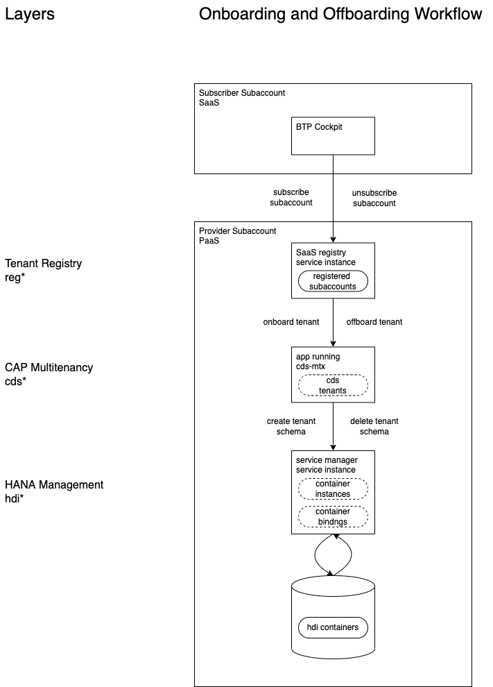

<!-- prettier-ignore-start -->
# Tenant Registry
{: .no_toc}
<!-- prettier-ignore-end -->

<!-- prettier-ignore -->
- TOC
{: toc}

## Summary

The tenant registry commands offer convenience for interacting with BTP's Saas Provisioning service (technical name
`saas-registry`).

The registry is the first of three perspectives that MTX Tool offers on tenant information. This is the
outermost layer, the deeper layers are [CAP Multitenancy]({{ site.baseurl }}/cap-multitenancy/) and
[HANA Management]({{ site.baseurl }}/hana-management/).

|  |
| :-------------------------------------------: |
|                _Tenant Layers_                |

For details and background information regarding the service, please consult the official documentation:

- [https://help.sap.com/docs/BTP](https://help.sap.com/docs/BTP)
- Subsection [Developing Multitenant Applications in the Cloud Foundry Environment](https://help.sap.com/docs/BTP/65de2977205c403bbc107264b8eccf4b/5e8a2b74e4f2442b8257c850ed912f48.html)
- API [https://saas-manager.cfapps.eu10.hana.ondemand.com/api](https://saas-manager.cfapps.eu10.hana.ondemand.com/api)

Commands for this area are:

```
   === tenant registry (reg) ===
~  regl   --registry-list [TENANT]                      list all subscribed subaccount names
~  regll  --registry-long-list [TENANT]                 long list all subscribed subaccounts
~  regs   --registry-service-config                     show registry service config
~  regj   --registry-job JOB_ID                         show registry job
          --registry-update TENANT_ID                   update tenant dependencies
          --registry-update-all                         update dependencies for all subscribed tenants
          --registry-update-url [TENANT_ID]             update all subscribed application URL
*         --registry-offboard TENANT_ID                 offboard tenant subscription
*         --registry-offboard-skip TENANT_ID SKIP_APPS  offboard tenant subscription skipping apps
          ...    [TENANT]                               filter list for tenant id or subdomain
          ...    --time                                 list includes timestamps
          ...    --skip-unchanged                       skip update for unchanged dependencies

~  are read-only commands
*  are potentially _dangerous_ commands
```

## Environment

| environment variable  | effect                                                                               |
| :-------------------- | :----------------------------------------------------------------------------------- |
| `MTX_REG_APP`         | override configured app for `saas-registry` accesses                                 |
| `MTX_REG_CONCURRENCY` | change concurrency used for service calls (default is 10)                            |
| `MTX_REG_FREQUENCY`   | change polling frequency milliseconds for service async job calls (default is 15000) |

## List and Long List

The list command `mtx regl` is the most common entry point and will show a table of all registered subacconts with
their most useful associated information.

With the addition of the `--time` option, the list will include both absolute and relative timestamps for creation
and the latest update.

If the provided information is insufficient or seems incomplete, then you can always fallback to the long list
`mtx regll`, which will show the service's full unparsed response data.

If you already know which subaccount or tenant id you want the information for, then you can filter the list or long
list, by providing that information, e.g., `mtx regl skyfin-company`.

## Example for List

Here is an example of listing all registered tenants:


## Registry Instance Introspection

The command `mtx regs` shows you the currently active configuration of the service instance. For details on the
meaning of the configuration, please consult the official BTP documentation (see [Summary](#summary)).

The command `mtx regj <job_id>` will show you the status of an ongoing job. Such job ids are issued for all
asynchronous tasks of the registry.

## Update Dependencies

The point of this command is comparatively complex and it will be rarely needed. The first part of the tenant
onboarding process requires an xsapp to publish a list of multitenancy services, i.e., it's "dependencies". These
services will then trust JWTs from the xsapp's uaa for that tenant's subaccont.

Now, if the xsapp developers want to add a new multitenancy service, but already have subscribed tenants, then you get
a rare problem. The new services would trust tenants that have subscribed after they were added, but not those that had
already been subscribed. For that reason, it is possible to re-do the dependency check and re-establish trust for
already subscribed tenants.

In most cases, you can safely trigger this update for all tenants with `mtx --registry-update-all`,
since no harm is done by re-establishing the trust for all subscribed subaccounts. Sometimes it pays to have more
control and trigger the update just for a single subscribed subaccount with `mtx --registry-update <tenant_id>`.

## Offboarding

Offboarding is the process of removing a tenant from the registry. Tenants, i.e., customer subaccount admins or test
subaccounts admins will usually trigger this process themselves in the BTP cockpit by unsubscribing from an xsapp. In
rare cases you, as the xsapp maintainer, may want to trigger this offboarding for a tenant. To achieve this run
`mtx --registry-offboard <tenant_id>`.

{: .warn}
This process is naturally irreversible and should be handled with extreme care.

In even rarer cases, you may want to remove the registry entry for a tenant _without_ informing the underlying xsapp.
One example would be if during a complete cleanup, if the xsapp was deleted prematurely, before all tenants had
unsubscribed, then it will not be possible to run a regular offboarding for the remaining tenants, since the
offboarding process expects a callback from the xsapp. In these circumstances you would use
`mtx --registry-offboard-skip <tenant_id> <xsapp_name>`.
