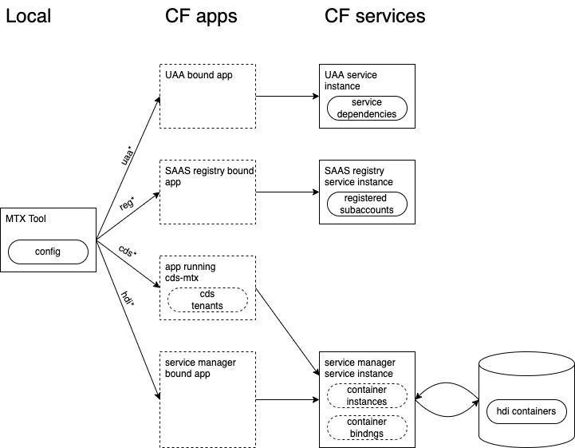

<!-- prettier-ignore-start -->

# Tool Setup
{: .no_toc}
<!-- prettier-ignore-end -->

<!-- prettier-ignore -->
- TOC 
{: toc}

## Summary

MTX Tool needs to know which apps you use to access the underlying CF services. The possible integrations are:

|  |
| :----------------------------------: |
|        _MTX Tool Integration_        |

You have the option to only configure some of these apps, if you want to use only the associated MTX Tool commands. You
will typically configure some app more than once, since apps are usually bound to multiple services.

Commands for this area are:

```
   === tool setup (set) ===
~  setl    --setup-list   list runtime config
   set     --setup        interactive setup for global config
   setcwd  --setup-local  interactive setup for local config
   setcc   --clean-cache  clean all app caches

~  are read-only commands
```

## Example for Setup

Here is an example of setting up a project globally for
the machine:


## Local Project Configuration

- run `mtx setcwd` in project root directory and create configuration
- commit `.mtxrc.json` to version control
- add `.mtxcache.json` to `.gitignore`

In this directory and its subdirectories, MTX Tool will use the local, project-specific configuration and cache file.

## App Environment Cache

In order to avoid reading the cf app environment every time MTX Tool is used, it will maintain a cache file
`.mtxcache.json` within the same directory where its configuration file `.mtxrc.json` is found. More specifically, there
is a local, project-specific cache, if a local configuration is maintained, and otherwise there is a global cache in the
`HOME` directory for Mac/Linux or `USERPROFILE` directory for Windows. The cache is automatically used for _12 hours_ and
then refreshed to capture potential changes.

If deployments with configuration chances happen during this 12 hour time window, you can have the case that cached
information is no longer usable and will lead to errors. In that case you can use the clean cache command `mtx setcc`
to quickly wipe all cached data.

## Overriding App Configuration

For special use cases, it is possible to override each configured app just-in-time by setting the following environment
variables:

- `MTX_UAA_APP` for the app used in uaa communication
- `MTX_REG_APP` for the app used in saas-registry communication
- `MTX_CDS_APP` for the app that runs the @sap/cds-mtx library endpoints
- `MTX_HDI_APP` for the app used in instance-manager or service-manager communication
- `MTX_SRV_APP` for the app that runs the server

Similar to the regular configuration, a single app can be used for multiple contexts.

## Blue-Green Deployment Configurations

For projects using
MTA's [legacy blue-green deployment](https://github.com/SAP-samples/cf-mta-examples/tree/main/blue-green-deploy-legacy):

- Configure the app names without `-blue` or `-green` suffix.
- The tool will use the active variant by itself.

For projects using
MTA's [strategy blue-green deployment](https://github.com/SAP-samples/cf-mta-examples/tree/main/blue-green-deploy-strategy):

- Configure the app names without `-live` or `-idle` suffix.
- For _read-only_ commands
  - The tool will use the active variant by itself.
- For other commands:
  - The tool will _not_ use applications in `-live` or `-idle` state to avoid problems.
