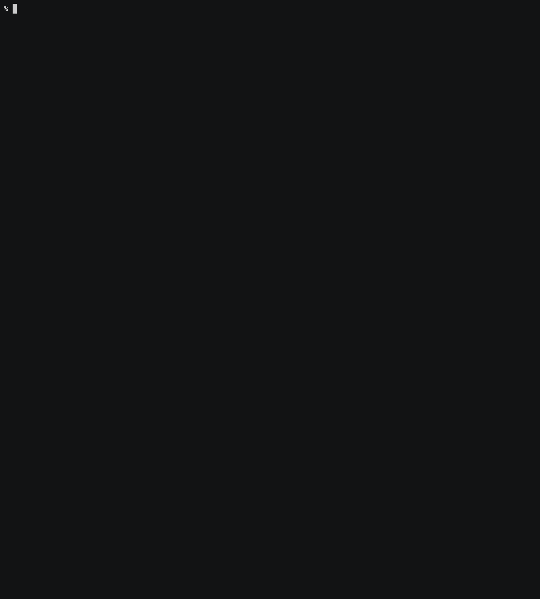

<!-- prettier-ignore-start -->
# User Authentication
{: .no_toc}
<!-- prettier-ignore-end -->

<!-- prettier-ignore -->
- TOC
{: toc}

## Summary

The central point of the user authentication commands is obtaining
[JSON web tokens](https://en.wikipedia.org/wiki/JSON_Web_Token) or JWTs. Either

- to decode them and see which privileges and other information are passed along within them, or
- to use them as authorization for related rest APIs, e.g., services or the server.

Obtaining the tokens always happens through a service instance of the "User Account and Authentication Service"
(technical name `xsuaa`).

For details and background information regarding the service, please consult the official documentation:

- [https://help.sap.com/docs/CP_AUTHORIZ_TRUST_MNG](https://help.sap.com/docs/CP_AUTHORIZ_TRUST_MNG)
- [https://help.sap.com/docs/IDENTITY_AUTHENTICATION](https://help.sap.com/docs/IDENTITY_AUTHENTICATION)
- [https://docs.cloudfoundry.org/api/uaa/](https://docs.cloudfoundry.org/api/uaa/)

Commands for this area are:

```
   === user authentication (uaa) ===
~  uaad   --uaa-decode TOKEN                                     decode JSON web token
~  uaac   --uaa-client [TENANT]                                  obtain uaa token for generic client
~  uaap   --uaa-passcode PASSCODE [TENANT]                       obtain uaa token for one-time passcode
~  uaau   --uaa-user USERNAME PASSWORD [TENANT]                  obtain uaa token for username password
~  uaasc  --uaa-service-client SERVICE [TENANT]                  obtain service token for generic client
~  uaasp  --uaa-service-passcode SERVICE PASSCODE [TENANT]       obtain service token for one-time passcode
~  uaasu  --uaa-service-user SERVICE USERNAME PASSWORD [TENANT]  obtain service token for username password
          ...    [TENANT]                                        obtain token for tenant, fallback to paas tenant
          ...    --decode                                        decode result token
          ...    --userinfo                                      add detailed user info for passcode or username
          ...    --json                                          uaa response in json

~  are read-only commands
```

## Environment

| environment variable | effect                                       |
| :------------------- | :------------------------------------------- |
| `MTX_UAA_APP`        | override configured app for `xsuaa` accesses |
| `UAA_PASSCODE`       | override argument `PASSCODE`                 |
| `UAA_USERNAME`       | override argument `USERNAME`                 |
| `UAA_PASSWORD`       | override argument `PASSWORD`                 |

It can be beneficial to pass _credentials_, especially long-term credentials like a password, along through environment
variables instead of commandline arguments. This is, for example, the default approach in pipeline solutions like
Jenkins and Github Actions.

## Decoding JWTs

Without even setting up MTX Tool, you can always take any web token you have in your clipboard and run `mtx uaad <jwt>`.

Beyond this simple use case you might want to decode, for example, a user's session JWT, in order to see which
privileges that particular user has. In order to achieve this:

- Ask for the user's subdomain. In our example it will be `skyfin-company`.
- Run `mtx uaap 123 skyfin-company`, i.e., use a made up passcode.
- MTX Tool will tell you the correct, landscape-dependent UAA url, which the user should use to get their one-time
  passcode. In our example it is `https://skyfin-company.authentication.sap.hana.ondemand.com/passcode`.
- Using the user's one-time passcode run `mtx uaap vjcOkwoVFL4ig17YIebYJYgKODSK6rsL skyfin-company --decode`.

## Accessing APIs as Technical User

If your server exposes an endpoint with JWT authentication, which is the default in CAP, then you can
access these endpoint with a generic client JWT that mtx can get for you.

| purpose                                    | command                             |
| :----------------------------------------- | :---------------------------------- |
| client JWT of provider subaccount (paas)   | `mtx uaac`                          |
| client JWT of subscriber subaccount (saas) | `mtx uaac <subdomain or tenant id>` |

Set the `Authorization` header as `Bearer <jwt>` in HTTP requests for the endpoints to pass validation. We use
[curl](https://curl.se) for this, but any other HTTP client works as well.

## Accessing APIs as User

Instead of acting as a generic client, you can access APIs as a regular user, provided the user in question gives you
a one-time-passcode, that their tenant's UAA published.

As an example, let's say the user in question works for a tenant with subdomain `microogle` in the BTP region `eu10`,
then they can obtain their passcode by logging in at
`https://microogle.authentication.eu10.hana.ondemand.com/passcode`

Using this one-time passcode, you can either get a regular JWT for accesses _as that user_, or their extended user
info:

| purpose               | command                                                     |
| :-------------------- | :---------------------------------------------------------- |
| user JWT              | `mtx uaap <passcode> <subdomain or tenant id>`              |
| user JWT via&nbsp;env | `UAA_PASSCODE=<passcode> mtx uaap <subdomain or tenant id>` |
| user JWT + user info  | `mtx uaap <passcode> <subdomain or tenant id> --userinfo`   |

Like before, if the command is run without the `subdomain or tenant_id` parameter, the tool will assume you mean the
provider subaccount (paas).

Using this passcode, you can also obtain extended information about the user. However, the contents of this vary based
on how the underlying identity provider and UAA are set up. In the identity provider, you can map assertion attributes
into the SAML bearer assertion of each user, and in the UAA these will be propagated as user information under certain
conditions.

{: .info }
For a list of possible attributes that SAP Identity Authentication Services (IAS) can map see
[Link](https://help.sap.com/docs/IDENTITY_AUTHENTICATION/6d6d63354d1242d185ab4830fc04feb1/d361407d36c5443298a909acbbd96ec4.html?version=Cloud).
If these assertions match `user_attributes` that UAA expects, see
[Link](https://docs.cloudfoundry.org/api/uaa/version/76.5.0/index.html#user-info), and the UAA's configuration
`xs-security.json` allows `"foreign-scope-references": ["user_attributes"]`, then they will show up as extended user
information.

Similarly to using a one-time passcode, you can access APIs as some user if you have both the username and password of
that user.

| purpose               | command                                                                             |
| :-------------------- | :---------------------------------------------------------------------------------- |
| user JWT              | `mtx uaau <username> <password> <subdomain or tenant id>`                           |
| user JWT via&nbsp;env | `UAA_USERNAME=<username> UAA_PASSWORD=<password> mtx uaau <subdomain or tenant id>` |
| user JWT + user info  | `mtx uaau <username> <password> <subdomain or tenant id> --userinfo`                |

## Accessing Service APIs

You can access services in the same way that the server accesses them, usually for debugging purposes. You will
need to know the label of the service and it needs to be bound to the app which is configured for user authentication.

| purpose               | command                                                                                        |
| :-------------------- | :--------------------------------------------------------------------------------------------- |
| client JWT            | `mtx uaasc <service> <subdomain or tenant id>`                                                 |
| user JWT              | `mtx uaasp <service> <passcode> <subdomain or tenant id>`                                      |
| user JWT via&nbsp;env | `UAA_PASSCODE=<passcode> mtx uaasp <service> <subdomain or tenant id>`                         |
| user JWT              | `mtx uaasu <service> <username> <password> <subdomain or tenant id>`                           |
| user JWT via&nbsp;env | `UAA_USERNAME=<username> UAA_PASSWORD=<password> mtx uaasu <service> <subdomain or tenant id>` |

For example `destination` is the label of the [BTP destination service](https://help.sap.com/docs/CP_CONNECTIVITY).
You will also need to choose a trusted subdomain to use, for example `skyfin-company`.

{: .info}
If the subdomain belongs to the
xsapp provider subaccount, then it will always be trusted. If the subdomain belongs to a different subaccount, it will
only be trusted if that account has successfully subscribed to the xsapp.

So, `mtx uaasc destination skyfin-company`, will give you the corresponding JWT, which can then be decoded or used as
`Authorization` header in an HTTP client.

## Example for Saas Service

Here is an example of retrieving a JWT for the bound destination service:


